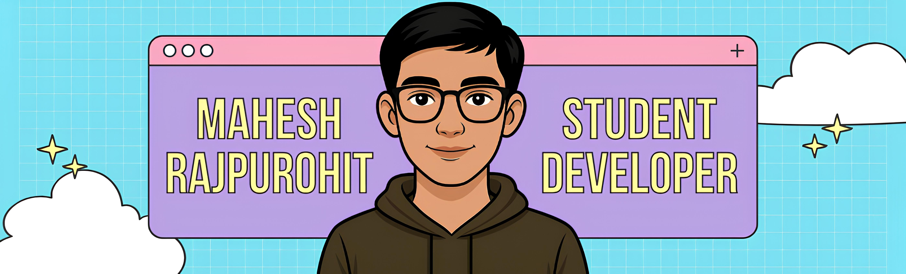

<div align="center">
  
</div>

<div align="center">
  
  [](https://git.io/typing-svg)
  
</div>

## ⚔️ RPG Character Stats & Skill Tree

<div align="center">

### 🧙‍♂️ **Developer Class: Full Stack Wizard** 🧙‍♂️

```
╔══════════════════════════════════════════════════════════════╗
║                    🏆 LEVEL 42 DEVELOPER 🏆                 ║
║                                                              ║
║  ⚡ EXP: ████████████████████████▓▓▓▓▓▓ 80% to next level   ║
║  ❤️  HP: ██████████████████████████████ 100/100 (Caffeine) ║
║  🧠 MP: ████████████████████████████▓▓▓ 90/100 (Focus)      ║
╚══════════════════════════════════════════════════════════════╝
```

</div>

### 🌟 **Skill Tree Progression**

<table>
<tr>
<td width="50%" valign="top">

#### 🖥️ **Frontend Branch**

```
HTML/CSS           ███████████████████▓  95%
JavaScript         █████████████████▓▓▓  83%
React              ███████████▓▓▓▓▓▓▓▓▓  58%
Vite.js            ████████████████▓▓▓▓  82%
Tailwind CSS       █████▓▓▓▓▓▓▓▓▓▓▓▓▓▓▓  27%
Bootstrap          █████████████▓▓▓▓▓▓▓  75%
TypeScript         ██████████▓▓▓▓▓▓▓▓▓▓  53%
```

#### 🎨 **UI/UX Mastery**

```
Figma              ███████████████████▓  90%
Responsive Design  ██████████████████▓▓  84%
Canva              █████████████████▓▓▓  78%
```

#### 📱 **Mobile & PWA Development**

```
FlutterFlow        █████████████▓▓▓▓▓▓▓  82%
PWA Basics         ████████████▓▓▓▓▓▓▓▓  72%
React Native       ██████████▓▓▓▓▓▓▓▓▓▓  10%
```

<!-- #### 🌐 🧩 **Web3 Development Branch**

```
Blockchain Basics  █████████████▓▓▓▓▓▓▓  82%
Smart Contracts    ████████████▓▓▓▓▓▓▓▓  72%
Crypto Wallets
(Metamask)         ██████████▓▓▓▓▓▓▓▓▓▓  10%
Solidity(Etherum)  ██████████▓▓▓▓▓▓▓▓▓▓  10%
KRNL               ██████████▓▓▓▓▓▓▓▓▓▓  10%
``` -->

</td>
<td width="50%" valign="top">

#### ⚙️ **Backend Branch**

```
Node.js            ██████████████████▓▓  91%
REST APIs          █████████████████▓▓▓  84%
MySQL              ███████████████████▓  95%
Supabase           ███████████████████▓  966%
Postman            ████████████████▓▓▓▓  83%
Python             ███████████████▓▓▓▓▓  77%
MongoDB            ████████████▓▓▓▓▓▓▓▓  67%
```

#### 🔧 **DevOps Mastery**

```
Git                ████████████████████ 100%
Vercel             ████████████████████ 100%
Netlify            ████████████████████ 100%
CI/CD              ████████████████████ 100%
AWS                ██████████▓▓▓▓▓▓▓▓▓▓  40%
Docker             ████████▓▓▓▓▓▓▓▓▓▓▓▓  34%
Kubernets          ███████▓▓▓▓▓▓▓▓▓▓▓▓▓  28%
Load Balancing     ████████▓▓▓▓▓▓▓▓▓▓▓▓  32%
```

<!-- #### 🧠 **Computer Science Core**

```
DSA(C++)           ████████▓▓▓▓▓▓▓▓▓▓▓▓  35%
DSA(Python)        ███████▓▓▓▓▓▓▓▓▓▓▓▓▓  32%
Algorithms         █████▓▓▓▓▓▓▓▓▓▓▓▓▓▓▓  30%
Time Complexity    █████▓▓▓▓▓▓▓▓▓▓▓▓▓▓▓  29%
DSA(Java)          ██▓▓▓▓▓▓▓▓▓▓▓▓▓▓▓▓▓▓  12%
``` -->

</td>

</tr>
</table>

### 🎮 **Special Abilities**

<div align="center">

|      🔮 **Ability**       |    📊 **Power Level**     | ⏰ **Cooldown** |
| :-----------------------: | :-----------------------: | :-------------: |
| 🚀 **Rapid Prototyping**  | ████████████████████ 100% |     0 hours     |
|  🧠 **Problem Solving**   | ███████████████████▓ 95%  |    5 minutes    |
| 🤝 **Team Collaboration** | ██████████████████▓▓ 90%  |     1 hour      |
|   📚 **Quick Learning**   | █████████████████▓▓▓ 85%  |   30 minutes    |
| 🎯 **Code Optimization**  | ████████████████▓▓▓▓ 80%  |     2 hours     |
| 🔍 **Debugging Mastery**  | ██████████████████▓▓ 90%  |   15 minutes    |

</div>

---

<div align="center">

### 📈 **Current Quest: Mastering the Art of Clean Code**

```
🎯 Quest Progress: ████████████████▓▓▓▓ 80%
🏆 Reward: +500 EXP, Unlock "Senior Developer" Title
⏳ Time Remaining: ∞ (Continuous Learning Mode)
```

_"The path of a developer is never complete - there's always a new framework to master!"_ ⚡

</div>

<br>

## 🏆 **Achievement Gallery**

<div align="center">

<table>
<tr>
<td align="center">


**🥇 Code Master**
<br/>
_100+ commits_

</td>
<td align="center">


**🌙 Night Owl**
<br/>
_3 AM commits_

</td>
<td align="center">


**🐛 Bug Hunter**
<br/>
_99+ bugs fixed_

</td>

<td align="center">


**☕ Coffee Addict**
<br/>
_Powered by caffeine_

</td>
<td align="center">


**😎Cool GIF**
<br />
_Random Stuff_

</td>
</tr>
</table>

<br>

<div align="center">


</div>
<br>

## � **NOW JAMMING** 🎵

<div align="center">

### 🎧 **Live Music Status** 🎧

[](https://open.spotify.com/user/upw50tfquxa479zbn502839zw)

<!-- Real-time alternative widget -->

[](https://open.spotify.com/user/upw50tfquxa479zbn502839zw)

**🔴 LIVE STATUS:** _Updates every 30 seconds - Like Discord!_

</div>

<!-- Alternative manual approach:
### 🎧 **Currently Vibing To** 🎧

**🎵 Now Playing:** Song Name - Artist Name
**🎨 Album:** Album Name
**⏰ Last Updated:** 21 June 2025

*Manual update - I change this when I'm coding with good music!*
-->

<br>

## �🌟 **CALL TO ACTION STATION** 🌟

**Ready to connect? Pick your portal and let's build something amazing together!**

[](https://www.instagram.com/draenox/)
[](https://www.linkedin.com/in/maheshrajpurohititm/)
[](https://x.com/MaheshR57657424)

[](https://discord.com/users/864058566967951370)
[](mailto:rajpurohitmahesh816@gmail.com)
[](https://google.com)

</div>
